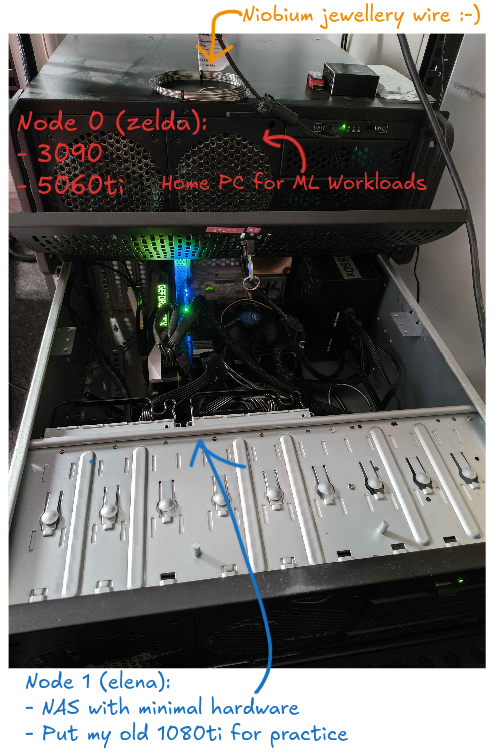
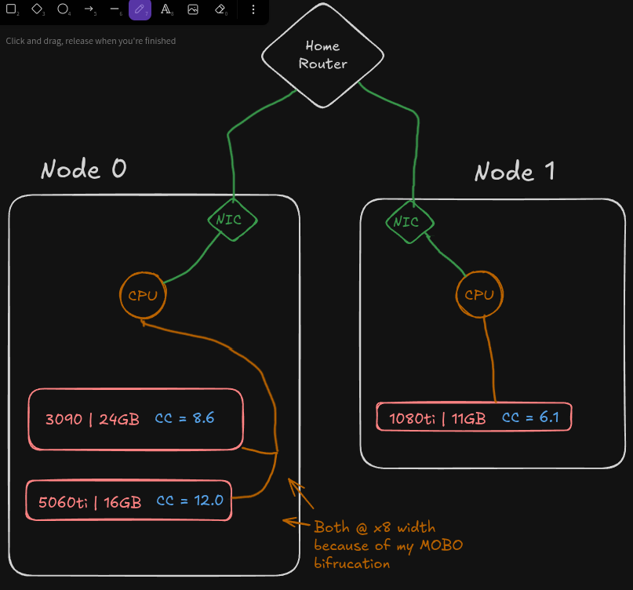
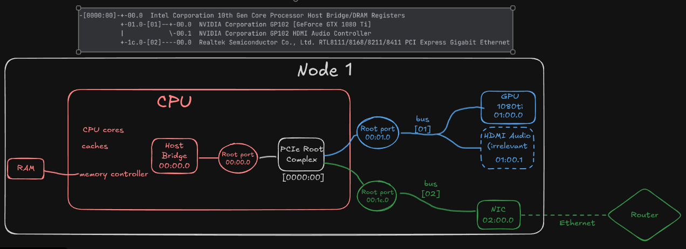
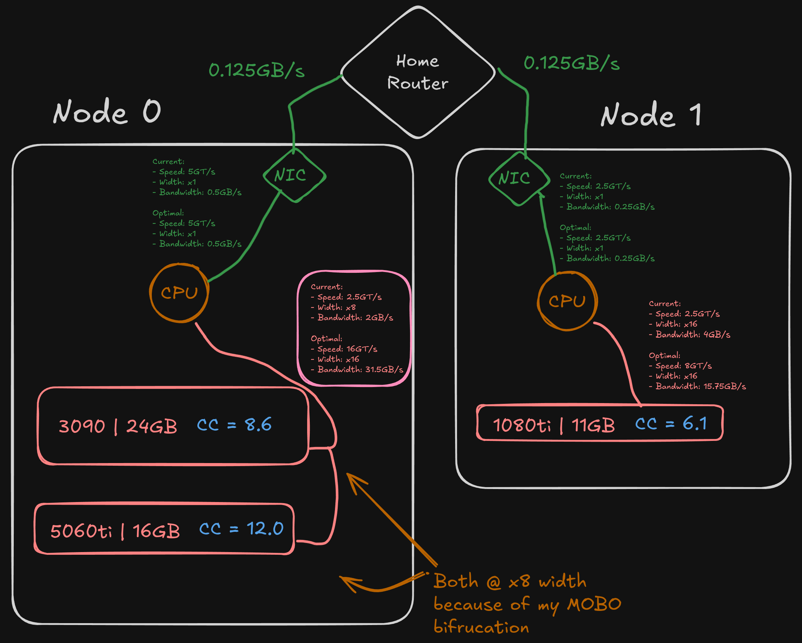
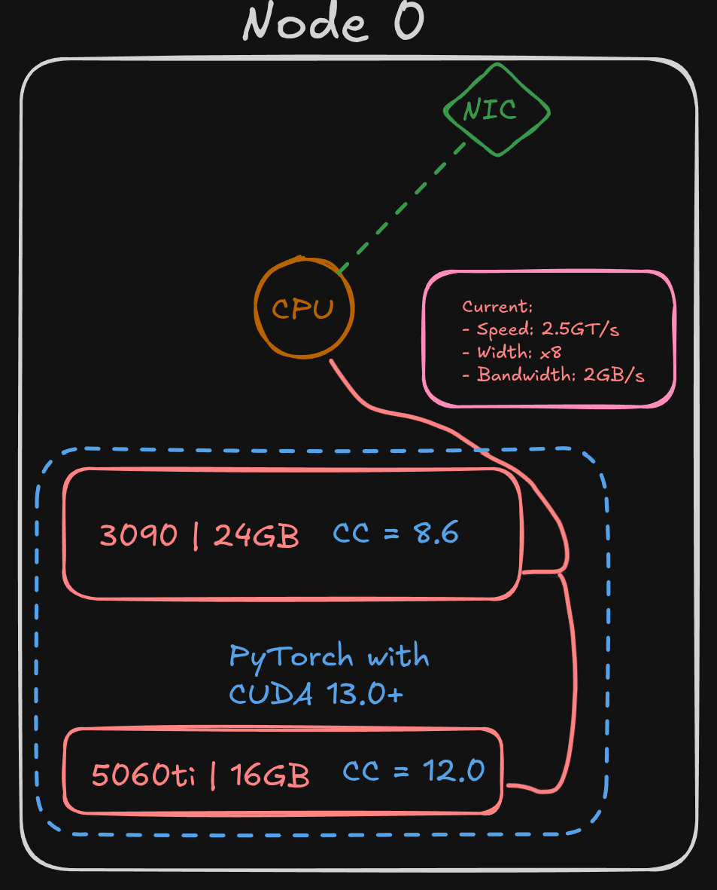
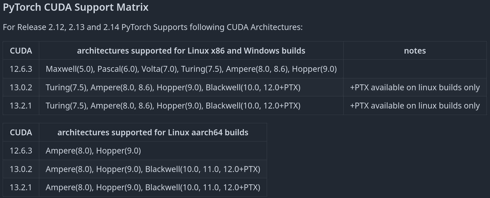
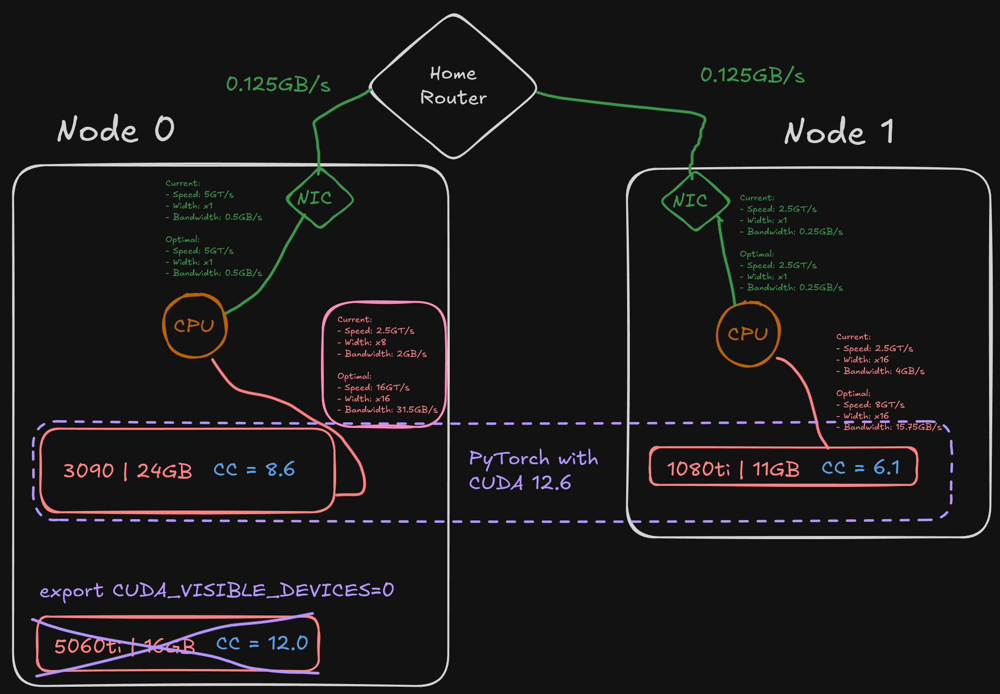

# 02 Heterogeneous Hardware
My intention for part 02 was to move straight onto `torch.distributed` across the 3 GPUs on my 2 nodes. This of course turned out to be much harder than I thought, but also a great learning experience I'll detail here in a technical log

## Node Hardware
```
# Node 0: My home PC has a `3090` and `5060ti` for ML dev work
Hostname: zelda
OS: Arch Linux x86_64
Kernel: Linux 7.1.4-arch1-1
CPU: AMD Ryzen 9 7900X3D (24) @ 5.66 GHz
GPU 1: NVIDIA GeForce RTX 5060 Ti [Discrete]
GPU 2: NVIDIA GeForce RTX 3090 [Discrete]
Memory: 7.50 GiB / 61.94 GiB (12%)
```
```
Node 1: I also have a NAS with a spare PCIE slot, I fit my old `1080ti`
Hostname: elena
OS: Arch Linux x86_64
Kernel: Linux 7.1.9-arch1-2
CPU: Intel(R) Core(TM) i3-10100 (8) @ 4.30 GHz
GPU: NVIDIA GeForce GTX 1080 Ti [Discrete]
Memory: 708.16 MiB / 15.48 GiB (4%)
```

Heterogeneous setups like this, which different cards holding different CC versions is quite common in smaller teams in industry. Its well worth me being familiar with common problems with such setups.



### Data Bandwidth
Generally memory movement and bandwidth is the primary bottleneck in most modern ML problems.

Lets get a feel for how fast data will be moving around my setup. We'll compare it to what we expect from a homogeneous higher-powered data center node in the next section.
`lspci` was particularly useful here.

We'll actually start with my Node 1. The simpler machine will be easier to read.

#### Node 1
```
lspci -tv

-[0000:00]-+-00.0  Intel Corporation 10th Gen Core Processor Host Bridge/DRAM Registers
           +-01.0-[01]--+-00.0  NVIDIA Corporation GP102 [GeForce GTX 1080 Ti]
           |            \-00.1  NVIDIA Corporation GP102 HDMI Audio Controller
           +-08.0  Intel Corporation Xeon E3-1200 v5/v6 / E3-1500 v5 / 6th/7th/8th Gen Core Processor Gaussian Mixture Model
           +-14.0  Intel Corporation 500 Series Chipset Family USB 3.2 Gen 2x2 (20 Gbs) xHCI Host Controller
           +-14.2  Intel Corporation 500 Series Chipset Family Shared SRAM
           +-16.0  Intel Corporation 500 Series Chipset Family CSME HECI #1
           +-17.0  Intel Corporation 500 Series Chipset Family SATA Controller (AHCI) (Server/Desktop)
           +-1c.0-[02]----00.0  Realtek Semiconductor Co., Ltd. RTL8111/8168/8211/8411 PCI Express Gigabit Ethernet Controller
           +-1d.0-[03]----00.0  MAXIO Technology (Hangzhou) Ltd. NVMe SSD Controller MAP1202 (DRAM-less)
           +-1d.3-[04]--
           +-1f.0  Intel Corporation H510 Chipset eSPI Controller
           +-1f.3  Intel Corporation Device f0c8
           +-1f.4  Intel Corporation 500 Series Chipset Family SMBus
           \-1f.5  Intel Corporation 500 Series Chipset Family SPI (flash) Controller
```
For our benchmarking purposes, we only really care about:
- **The CPU**
- **RAM**
- **Graphics cards**
- **NIC** (the network card, connects to router by e.g. ethernet)

So lets trim down the dump and draw a nice diagram.
```
-[0000:00]-+-00.0  Intel Corporation 10th Gen Core Processor Host Bridge/DRAM Registers
           +-01.0-[01]--+-00.0  NVIDIA Corporation GP102 [GeForce GTX 1080 Ti]
           |            \-00.1  NVIDIA Corporation GP102 HDMI Audio Controller
           +-1c.0-[02]----00.0  Realtek Semiconductor Co., Ltd. RTL8111/8168/8211/8411 PCI Express Gigabit Ethernet Controller
```

From this verbose dump we can pick out the relevant data lanes and find out their bandwidth. Ignoring the USBs, various controllers, and other things going on.

The following diagram is an oversimplification, we can't always tell from lspci exactly how many physical buses there are, or what their physical layout it. We just get the `logical` layout. Nonetheless, `Node 1` is a little like this


Now lets get the width and speed of the buses around these devices
```
sudo lspci -vv -s 01:00.0   # PCIe Root complex <-> GPU
sudo lspci -vv -s 02:00.0   # PCIe Root complex <-> Ethernet
```

Lets inspect the output for the GPU
```
sudo lspci -vv -s 01:00.0   # PCIe Root complex <-> GPU
01:00.0 VGA compatible controller: NVIDIA Corporation GP102 [GeForce GTX 1080 Ti] (rev a1) (prog-if 00 [VGA controller])
	Subsystem: ASUSTeK Computer Inc. Device 85e2
	Control: I/O+ Mem+ BusMaster+ SpecCycle- MemWINV- VGASnoop- ParErr- Stepping- SERR- FastB2B- DisINTx+
	Status: Cap+ 66MHz- UDF- FastB2B- ParErr- DEVSEL=fast >TAbort- <TAbort- <MAbort- >SERR- <PERR- INTx-
	Latency: 0
	Interrupts: pin B disabled, MSI(X) routed to IRQ 145
	Region 0: Memory at a2000000 (32-bit, non-prefetchable) [size=16M]
	Region 1: Memory at 90000000 (64-bit, prefetchable) [size=256M]
	Region 3: Memory at a0000000 (64-bit, prefetchable) [size=32M]
	Region 5: I/O ports at 4000 [size=128]
	Expansion ROM at 000c0000 [virtual] [disabled] [size=128K]
	Capabilities: [60] Power Management version 3
		Flags: PMEClk- DSI- D1- D2- AuxCurrent=0mA PME(D0-,D1-,D2-,D3hot-,D3cold-)
		Status: D0 NoSoftRst+ PME-Enable- DSel=0 DScale=0 PME-
	Capabilities: [68] MSI: Enable+ Count=1/1 Maskable- 64bit+
		Address: 00000000fee00598  Data: 0000
	Capabilities: [78] Express (v2) Legacy Endpoint, IntMsgNum 0
		DevCap:	MaxPayload 256 bytes, PhantFunc 0, Latency L0s unlimited, L1 <64us
			ExtTag+ AttnBtn- AttnInd- PwrInd- RBE+ FLReset- TEE-IO-
		DevCtl:	CorrErr+ NonFatalErr+ FatalErr+ UnsupReq+
			RlxdOrd+ ExtTag+ PhantFunc- AuxPwr- NoSnoop-
			MaxPayload 256 bytes, MaxReadReq 512 bytes
		DevSta:	CorrErr- NonFatalErr- FatalErr- UnsupReq- AuxPwr- TransPend-
		LnkCap:	Port #0, Speed 8GT/s, Width x16, ASPM L0s L1, Exit Latency L0s <512ns, L1 <4us
			ClockPM+ Surprise- LLActRep- BwNot- ASPMOptComp+
		LnkCtl:	ASPM Disabled; RCB 64 bytes, LnkDisable- CommClk+
			ExtSynch- ClockPM+ AutWidDis- BWInt- AutBWInt- FltModeDis-
		LnkSta:	Speed 2.5GT/s (downgraded), Width x16
			TrErr- Train- SlotClk+ DLActive- BWMgmt- ABWMgmt-
		DevCap2: Completion Timeout: Range AB, TimeoutDis+ NROPrPrP- LTR+
			 10BitTagComp- 10BitTagReq- OBFF Via message, ExtFmt- EETLPPrefix-
			 EmergencyPowerReduction Not Supported, EmergencyPowerReductionInit-
			 FRS-
			 AtomicOpsCap: 32bit- 64bit- 128bitCAS-
		DevCtl2: Completion Timeout: 50us to 50ms, TimeoutDis-
			 AtomicOpsCtl: ReqEn-
			 IDOReq- IDOCompl- LTR+ EmergencyPowerReductionReq-
			 10BitTagReq- OBFF Disabled, EETLPPrefixBlk-
		LnkCap2: Supported Link Speeds: 2.5-8GT/s, Crosslink- Retimer- 2Retimers- DRS-
		LnkCtl2: Target Link Speed: 8GT/s, EnterCompliance- SpeedDis-
			 Transmit Margin: Normal Operating Range, EnterModifiedCompliance- ComplianceSOS-
			 Compliance Preset/De-emphasis: -6dB de-emphasis, 0dB preshoot
		LnkSta2: Current De-emphasis Level: -3.5dB, EqualizationComplete+ EqualizationPhase1+
			 EqualizationPhase2+ EqualizationPhase3+ LinkEqualizationRequest-
			 Retimer- 2Retimers- CrosslinkRes: unsupported, FltMode-
	Capabilities: [100 v1] Virtual Channel
		Caps:	LPEVC=0 RefClk=100ns PATEntryBits=1
		Arb:	Fixed- WRR32- WRR64- WRR128-
		Ctrl:	ArbSelect=Fixed
		Status:	InProgress-
		VC0:	Caps:	PATOffset=00 MaxTimeSlots=1 RejSnoopTrans-
			Arb:	Fixed- WRR32- WRR64- WRR128- TWRR128- WRR256-
			Ctrl:	Enable+ ID=0 ArbSelect=Fixed TC/VC=ff
			Status:	NegoPending- InProgress-
	Capabilities: [250 v1] Latency Tolerance Reporting
		Max snoop latency: 34326183936ns
		Max no snoop latency: 34326183936ns
	Capabilities: [128 v1] Power Budgeting <?>
	Capabilities: [420 v2] Advanced Error Reporting
		UESta:	DLP- SDES- TLP- FCP- CmpltTO- CmpltAbrt- UnxCmplt- RxOF- MalfTLP-
			ECRC- UnsupReq- ACSViol- UncorrIntErr- BlockedTLP- AtomicOpBlocked- TLPBlockedErr-
			PoisonTLPBlocked- DMWrReqBlocked- IDECheck- MisIDETLP- PCRC_CHECK- TLPXlatBlocked-
		UEMsk:	DLP- SDES- TLP- FCP- CmpltTO- CmpltAbrt- UnxCmplt- RxOF- MalfTLP-
			ECRC- UnsupReq- ACSViol- UncorrIntErr- BlockedTLP- AtomicOpBlocked- TLPBlockedErr-
			PoisonTLPBlocked- DMWrReqBlocked- IDECheck- MisIDETLP- PCRC_CHECK- TLPXlatBlocked-
		UESvrt:	DLP+ SDES+ TLP- FCP+ CmpltTO- CmpltAbrt- UnxCmplt- RxOF+ MalfTLP+
			ECRC- UnsupReq- ACSViol- UncorrIntErr+ BlockedTLP- AtomicOpBlocked- TLPBlockedErr-
			PoisonTLPBlocked- DMWrReqBlocked- IDECheck- MisIDETLP- PCRC_CHECK- TLPXlatBlocked-
		CESta:	RxErr- BadTLP- BadDLLP- Rollover- Timeout- AdvNonFatalErr- CorrIntErr- HeaderOF-
		CEMsk:	RxErr- BadTLP- BadDLLP- Rollover- Timeout- AdvNonFatalErr+ CorrIntErr- HeaderOF+
		AERCap:	First Error Pointer: 00, ECRCGenCap- ECRCGenEn- ECRCChkCap- ECRCChkEn-
			MultHdrRecCap- MultHdrRecEn- TLPPfxPres- HdrLogCap-
		HeaderLog: 00000000 00000000 00000000 00000000
	Capabilities: [600 v1] Vendor Specific Information: ID=0001 Rev=1 Len=024 <?>
	Capabilities: [900 v1] Secondary PCI Express
		LnkCtl3: LnkEquIntrruptEn- PerformEqu-
		LaneErrStat: 0
	Kernel driver in use: nvidia
	Kernel modules: nouveau, nvidia_drm, nvidia
```

Helping to read this. `LnkCap` lines are what **could** this link do. `LnkSta` is what I'm actually getting right now.
```
LnkCap:	Port #0, Speed 8GT/s, Width x16, ASPM L0s L1, Exit Latency L0s <512ns, L1 <4us
LnkSta:	Speed 2.5GT/s (downgraded), Width x16
```
This means 2.5 Giga TRANSFERS per second, at a width of x16. Basically, this correlates to the PCIe generation its running at, which you can look up the throughput for externally. (Thats because theres encoding efficiency and other concepts i don't quite understand to account for too). So I just look at:
- `LnkSta: Speed 2.5GT/s`
- "Oh, thats probably \**googles\** PCIe Gen 1"
- That means its `4GB/s`

These are *THEORETICAL* bandwidths. In practice no algorithm is perfect, and bandwidth from true applications can often be significantly lower.

#### Node 0
Following the process in node 0, let me update my diagram with the rough, theoretical bandwidths between each component in my setup.
```
lspci -tv
-[0000:00]-+-00.0  Advanced Micro Devices, Inc. [AMD] Raphael/Granite Ridge Root Complex
           +-00.2  Advanced Micro Devices, Inc. [AMD] Raphael/Granite Ridge IOMMU
           +-01.0  Advanced Micro Devices, Inc. [AMD] Raphael/Granite Ridge Dummy Host Bridge
           +-01.1-[01]--+-00.0  NVIDIA Corporation GA102 [GeForce RTX 3090]
           |            \-00.1  NVIDIA Corporation GA102 High Definition Audio Controller
           +-01.2-[02]----00.0  Samsung Electronics Co Ltd NVMe SSD Controller S4LV008[Pascal]
           +-01.3-[03]--+-00.0  NVIDIA Corporation GB206 [GeForce RTX 5060 Ti]
           |            \-00.1  NVIDIA Corporation GB206 High Definition Audio Controller
           +-02.0  Advanced Micro Devices, Inc. [AMD] Raphael/Granite Ridge Dummy Host Bridge
           +-02.1-[04-16]----00.0-[05-16]--+-00.0-[06]--
           |                               +-04.0-[07]--
           |                               +-05.0-[08]--
           |                               +-06.0-[09]--
           |                               +-07.0-[0a]--
           |                               +-08.0-[0b-14]----00.0-[0c-14]--+-00.0-[0d]--
           |                               |                               +-04.0-[0e]----00.0  MEDIATEK Corp. MT7922 802.11ax PCI Express Wireless Network Adapter
           |                               |                               +-05.0-[0f]----00.0  Realtek Semiconductor Co., Ltd. RTL8125 2.5GbE Controller
           |                               |                               +-06.0-[10]--
           |                               |                               +-07.0-[11]--
           |                               |                               +-08.0-[12]--
           |                               |                               +-0c.0-[13]----00.0  Advanced Micro Devices, Inc. [AMD] 600 Series Chipset USB 3.2 Controller
           |                               |                               \-0d.0-[14]----00.0  Advanced Micro Devices, Inc. [AMD] 600 Series Chipset SATA Controller
           |                               +-0c.0-[15]----00.0  Advanced Micro Devices, Inc. [AMD] 600 Series Chipset USB 3.2 Controller
           |                               \-0d.0-[16]----00.0  Advanced Micro Devices, Inc. [AMD] 600 Series Chipset SATA Controller
           +-03.0  Advanced Micro Devices, Inc. [AMD] Raphael/Granite Ridge Dummy Host Bridge
           +-04.0  Advanced Micro Devices, Inc. [AMD] Raphael/Granite Ridge Dummy Host Bridge
           +-08.0  Advanced Micro Devices, Inc. [AMD] Raphael/Granite Ridge Dummy Host Bridge
           +-08.1-[17]--+-00.0  Advanced Micro Devices, Inc. [AMD/ATI] Raphael
           |            +-00.1  Advanced Micro Devices, Inc. [AMD/ATI] Radeon High Definition Audio Controller
           |            +-00.2  Advanced Micro Devices, Inc. [AMD] Family 19h PSP/CCP
           |            +-00.3  Advanced Micro Devices, Inc. [AMD] Raphael/Granite Ridge USB 3.1 xHCI
           |            +-00.4  Advanced Micro Devices, Inc. [AMD] Raphael/Granite Ridge USB 3.1 xHCI
           |            \-00.6  Advanced Micro Devices, Inc. [AMD] Ryzen HD Audio Controller
           +-08.3-[18]----00.0  Advanced Micro Devices, Inc. [AMD] Raphael/Granite Ridge USB 2.0 xHCI
           +-14.0  Advanced Micro Devices, Inc. [AMD] FCH SMBus Controller
           +-14.3  Advanced Micro Devices, Inc. [AMD] FCH LPC Bridge
           +-18.0  Advanced Micro Devices, Inc. [AMD] Raphael/Granite Ridge Data Fabric; Function 0
           +-18.1  Advanced Micro Devices, Inc. [AMD] Raphael/Granite Ridge Data Fabric; Function 1
           +-18.2  Advanced Micro Devices, Inc. [AMD] Raphael/Granite Ridge Data Fabric; Function 2
           +-18.3  Advanced Micro Devices, Inc. [AMD] Raphael/Granite Ridge Data Fabric; Function 3
           +-18.4  Advanced Micro Devices, Inc. [AMD] Raphael/Granite Ridge Data Fabric; Function 4
           +-18.5  Advanced Micro Devices, Inc. [AMD] Raphael/Granite Ridge Data Fabric; Function 5
           +-18.6  Advanced Micro Devices, Inc. [AMD] Raphael/Granite Ridge Data Fabric; Function 6
           \-18.7  Advanced Micro Devices, Inc. [AMD] Raphael/Granite Ridge Data Fabric; Function 7
```

Giving some help on how to read the devices from this, e.g. my NIC here for Node 0:
```
           +-02.1-[04-16]----00.0-[05-16]--+-00.0-[06]--
           |                               +-04.0-[07]--
           |                               +-05.0-[08]--
           |                               +-06.0-[09]--
           |                               +-07.0-[0a]--
           |                               +-08.0-[0b-14]----00.0-[0c-14]--+-00.0-[0d]--
           |                               |                               +-04.0-[0e]----00.0  MEDIATEK Corp. MT7922 802.11ax PCI Express Wireless Network Adapter
           |                               |                               +-05.0-[0f]----00.0  Realtek Semiconductor Co., Ltd. RTL8125 2.5GbE Controller
           |                               |                               +-06.0-[10]--
           |                               |                               +-07.0-[11]--
           |                               |                               +-08.0-[12]--
           |                               |                               +-0c.0-[13]----00.0  Advanced Micro Devices, Inc. [AMD] 600 Series Chipset USB 3.2 Controller
           |                               |                               \-0d.0-[14]----00.0  Advanced Micro Devices, Inc. [AMD] 600 Series Chipset SATA Controller
```
Would be `0f:00.0`. Read the `[]` for the logical bus id.

`cat /sys/class/net/{interface}/speed` works for remote systems where you're not too sure what the network speed is



### Important observations
- Notice the pink box in particular. We can see the width has been has been downgraded to x8 as I told you. However, the speed is downgraded too. This is the kind of stuff one should watch out for.
- The bottleneck is of course the slowest link in the chain. Therefore, having a distributed setup that relies on home networking like mine would expose the memory bandwidth bottleneck to the lowest green number in the diagram. Not just the lowest red number.
- I am of course using my home setup for practice. But you may find a lot of SME businesses won't have super optimal inter-node setups. This gives us ideas as top why. I'll analyse a more optimal inter/intra node setup in the next section.

## Intra-node setup
My inter-node distributed setup involves using `torchrun` wholly inside `node 0` only. This is useful should I have a workload in need of `24GB<` VRAM.


Now we need an enviroment that can handle and run code on both GPUs. I'll be using PyTorch, so we can helpfully check out [PyTorch compatability with Nvidia hardware](https://github.com/pytorch/pytorch/blob/main/RELEASE.md#pytorch-cuda-support-matrix)


I'll need `PyTorch` built with `CUDA 13+`. No worries.

## Inter-node setup
I was hoping to use all 3 of my GPUs at first. However, look closely again at the above support matrix, and the blue CUDA architecture versions in my diagram.

There isn't actually a Torch version that can support my `1080ti 6.1` and `5060ti 12.0` at the same time.

So for my inter-node work, I'll need to ignore my second GPU and use the same `torch` version, but built with a slightly lower version of CUDA.
.

I did try running both together at once, but I ran into a specific error about the bit width of an expected communication. Since the `nccl` libraries underneath are slightly different, I considered this a death sentence for the idea. I'm happy to be proven wrong however.


## NCCL Communications and problems
With both environments ready, the next thing is debugging communications and problems.

There are similarities with the MPI through the concepts of `WORLD_SIZE`, `RANK`, and `LOCAL_RANK`.

However, `nccl` and `torch.dist` appear distinct in a few different ways:

- `MASTER_ADDRESS` and `MASTER_PORT` serve as a `rendezvous` point between nodes. This is not quite the same as having a master rank process. The rendezvous isn't exactly one of the spawned process ranks.
- `torchrun` sets up the world and ranks, and handles the rendezvous communications.
- `nccl` as the collectives communications library actually runs implementations for certain collective primitives, e.g.
```py
import os
import torch
import torch.distributed as dist

rank = os.environ['RANK']
x = torch.tensor(rank)
dist.all_reduce(x)
```

### Bugs I fixed
NCCL likes to hang when communications don't work. Fortunately, you can aggressively turn on debugging info to find what the problems are. This process took me a good 4 hours first time, and had me handling the following problems across ML and servers etc...
- **Firewalls:**
  - `iptables`, `iftables`, `ufw`. Node 1 is usually my NAS afterall. There were networking settings I had to change to allow communication between machines across the port ranges NCCL likes to use.
- **Host name resolution:**
  - After all my firewall fixing antic, the penultimate bug i had was actually a typo in `/etc/hosts`. Getting the IP addresses the wrong way round was a humbling way to lose a final 30 minutes lol
- **Network interfaces:**
  - The final bug to fix making sure to specify the interface socket name. `enp2s0`. These are of course different across machines in my heterogeneous setup


## Conclusions
Having experience setting up `torch.dist` and `nccl` in a home style heterogeneous cluster was a fantastic way to brush up on a lot of fundamentals, and prepare myself for proper profiling and design of code.

Next up, I want to detail a more professional homogeneous setup, perhaps something on AWS, and repeat parts of this process. When I then compare performance of code across these different setups, I'll be able to reason about why.