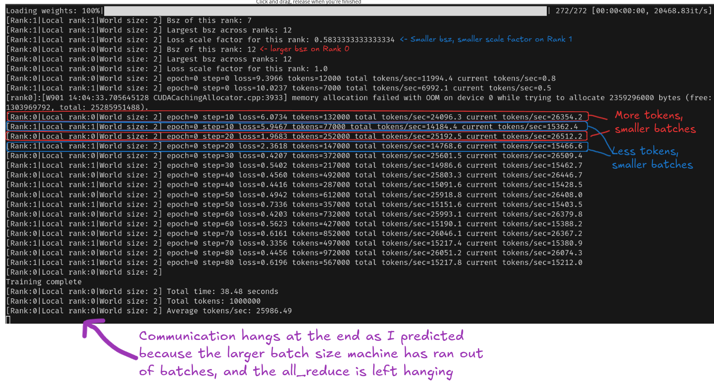
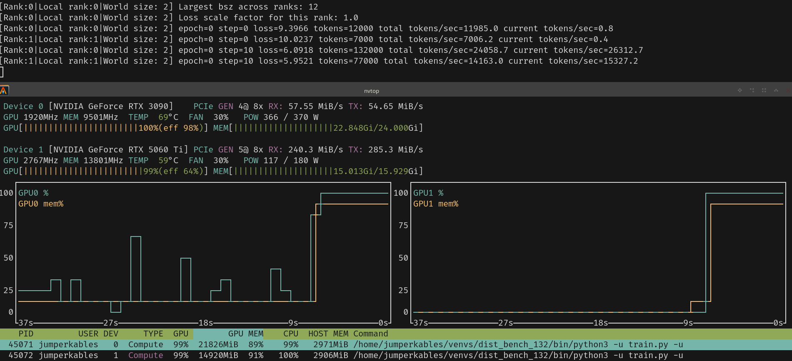
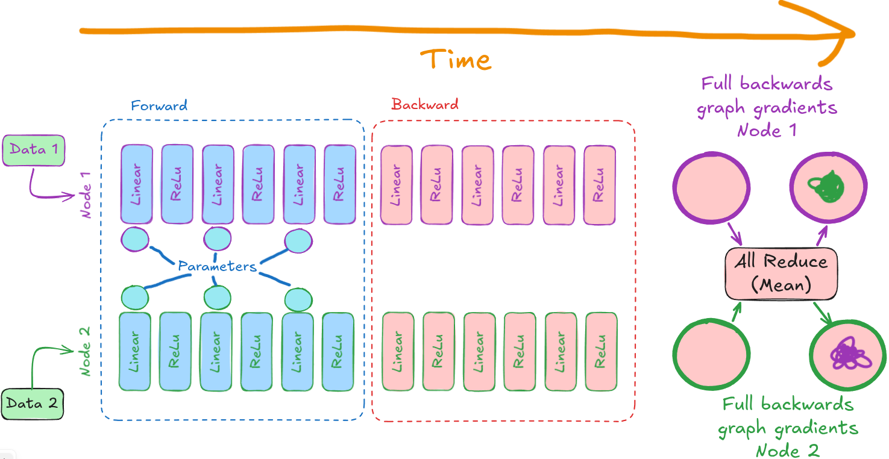
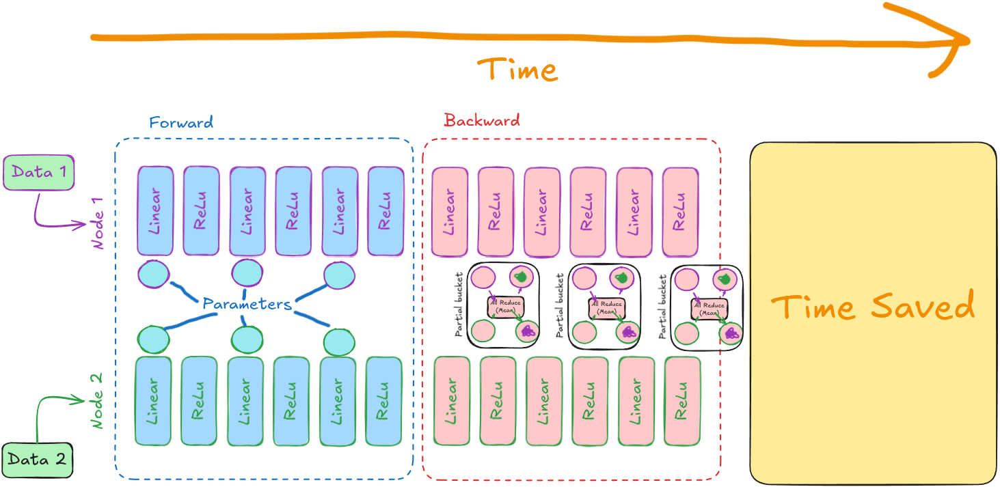

from transformers import AutoModelForCausalLMfrom transformers import AutoModelForCausalLM

# Torch DDP
Putting all the fundamentals together and trying some real LLM training (small ones though)

## Setup:
- Model = `HuggingFaceTB/SmolLM2-135M`
- Dataset = `Salesforce/wikitext - wikitext-2-raw-v1`
- 
## 01 - Single GPU Baseline
Starting by getting a single GPU baseline result for **training** an LLM.
- Standard PyTorch `model` and `dataloader` object

## 02 - Torch DDP Baseline
Using the torch DDP objects as recommended. Experimented between my different GPUs, measure the throughput in tokens per second.
```py
# Before - Single process PyTorch
model = AutoModelForCausalLM(...)
dataloader = DataLoader(
    dataset,
    batch_size=...,
    shuffle=True,
    sampler=None
)

# After - DDP drop in (very succinct drop in code, hats off to creators)
from torch.nn.parallel import DistributedDataParallel as DDP
from torch.utils.data.distributed import DistributedSampler
model = AutoModelForCausalLM(...)
model = DDP(model)
dataloader = DataLoader(
    dataset,
    batch_size=...,
    shuffle=False,  # Docs specify that shuffle should be false for DDP
    sampler=DistributedSampler(dataset),
)
```


## Analysis
- Broadly, `torch.DDP` is working fantastically here. I've shown that distributing the DDP setup and increase total tokens per second throughput in training.
- Even if the 2 GPUs were identical, we would not expect an exact `2x` speedup. Communication and synchronisation overhead between the GPUs would cause some measure of slowdown.
  - This can be seen at a crude high level through the reduced GPU utilisation reported by `nvtop`.
- For the `360M` model size, my `3090 and 5060ti` experiment gets `19419 tokens/second`.
- Compares to the "theoretical maximum" of both GPUs individually at that sequence length and model size
  - `13900 (3090) + 10200 (5060ti) = 24100` tokens per second
  - `19419 (DDP tokens/s) % 24100 (theoretical 'maximum') = 80.6%` 'efficient'. Thats roughly 20% of total combined capacity lost to communications and other overheads.

### Different batch sizes
Naturally, I might be able to squeeze more raw tokens per second with a large batch size for the larger GPU. However, we need to tread carefully:
- Uneven batch sizes would require a weighted scaling of their contributions to the reduce gradient updates:
```
GPU 0: Bsz 10 -> Loss = 10 -|
                            Proper weighted loss = 13.333
GPU 1: Bsz  5 -> Loss = 20 -|
```
- I believe the distributed sampler object is not handling this at all. 
- For mathematical correctness, it would be user responsibility to manually scale the loss ahead of the all reduce on each node by communicating local and global batch sizes
- We'd still need to make sure on node doesn't run out of batches before the others.
  - This would leave idle compute wasted
  - It could even cause an error by having `all_reduce` communications hang as one node waits for contributions from another node with a large bsz that already finished its epoch.
- See these issues and discussions I found if you're interested:
  - [PT Issue - Support uneven DDP inputs](https://github.com/pytorch/pytorch/issues/33148#issuecomment-584400677)
  - [Supporting different bszs](https://github.com/pytorch/pytorch/issues/67253)
  - This one is awesome: [Use DDP communucation hooks to scale the grads](https://docs.pytorch.org/docs/2.13/ddp_comm_hooks.html)

I actually decided to implement this myself:
1. Perform a max reduction across batch sizes, get the largest batch size, and scale every other loss relative to it:
```py
biggest_bsz = torch.tensor(BATCH_SIZE, device=DEVICE)
dist.all_reduce(biggest_bsz, op=dist.ReduceOp.MAX)
bsz_loss_scale = BATCH_SIZE / biggest_bsz.item()
rprint(f"Bsz of this rank: {BATCH_SIZE}")
rprint(f"Largest bsz across ranks: {biggest_bsz}")
rprint(f"Loss scale factor for this rank: {bsz_loss_scale}")
```
2. ChatGPT helped me understand the way to write hooks:
```py
def weighted_grad_hook(state, bucket):
    grad = bucket.buffer()

    # Scale the gradient by this rank's scale factor
    grad.mul_(state.scale)

    # Sum the now-scaled contributions across all ranks
    work = dist.all_reduce(
        grad,
        op=dist.ReduceOp.SUM,
        async_op=True
    )
    return work.get_future().then(
        lambda future: future.value()[0]
    )

@dataclass
class GradScaleState:
    scale: float

...
...
state = GradScaleState(scale=bsz_loss_scale)
model = DDP(model)
model.register_comm_hook(state, weighted_grad_hook)
```
3. It worked!!!!  
4. If I wanted to push this demo any further, I would adjust the sampler logic per rank such that there is an even number of batches, or any final uneven ones silently return 0. But I have better things to move onto.


## Benchmarking
I'm going to simplify the benchmarking criteria to just tokens per second

| Notes                         | Node setup | GPU utilisation `nvtop`    | Batch size | Seq length | Model size |    VRAM Used (GB) |  Distributed Algorithm |   Tokens per second |
|:------------------------------|:-----------|:---------------------------|-----------:|-----------:|-----------:|------------------:|-----------------------:|--------------------:|
|                               | 0          | 3090   (99%)               |          4 |       2700 |       135M |           22.2/24 |                    N/A |               18700 |
|                               | 0          | 3090   (99%)               |          4 |       1000 |       135M |            8.6/24 |                    N/A |               23700 |
|                               | 0          | 3090   (99%)               |         12 |       1000 |       135M |           21.4/24 |                    N/A |               25700 |
|                               | 0          | 3090   (99%)               |          7 |       1000 |       135M |           14.3/24 |                    N/A |               24650 |
|                               | 0          | 5060ti (99%)               |          7 |       1000 |       135M |           14.3/16 |                    N/A |               18550 |
|                               | 0          | 3090   (83%) 5060ti (75%)  |      7 + 7 |       1000 |       135M | 14.3/24 + 14.3/16 |              torch.DDP | 18019+18008 = 36027 |
| Uneven batches implementation | 0          | 3090   (96%) 5060ti (63%)  |     12 + 7 |       1000 |       135M | 22.5/24 + 14.9/16 | torch.DDP (batch hook) | 25100+15000 = 40200 |
|                               | 1          | 1080ti (95%)               |          3 |       1000 |       135M |           10.2/11 |                    N/A |                3520 |
| Inter node setup              | 0 + 1      | 3090   (43%) 1080ti (100%) |     12 + 3 |       1000 |       135M | 22.5/24 + 10.5/11 | torch.DDP (batch hook) |    4345+1084 = 5429 |
|                               |            |                            |            |            |            |                   |                        |                     |
|                               | 0          | 3090   (99%)               |         10 |        800 |       360M |           23.0/24 |                    N/A |               13300 |
|                               | 0          | 3090   (99%)               |         10 |        500 |       360M |           15.0/16 |                    N/A |               13900 |
|                               | 0          | 5060ti (84%)               |         10 |        500 |       360M |           15.0/16 |                    N/A |               10200 |
|                               | 0          | 3090   (85%) 5060ti (79%)  |    10 + 10 |        500 |       360M | 15.0/16 + 15.0/16 |              torch.DDP |   9720+9699 = 19419 |


- Using my uneven batching method, I've managed to squeeze another 4000 tokens per second out of my heterogeneous node setup.
  - See `uneven batches implementation`
- We can see the `1080ti` performance is much worse than both of GPUs, check the only row with `node setup = 1`. Approximately 3520 tokens/s
- Note for the inter-node setup, of course the much faster `3090` is underutilised and bottlenecked. Interestingly however, the `1080ti` contributiosn are roughly 33% of what they were before. Down from `3520` to `1084` tokens per second
  - I suspect this is largely down to the networking overhead between the nodes.


## Gradient buckets
- A key to efficient parallel/distributed workloads is overlapping otherwise-sequential work intelligently. For `torch.DDP`, we want `HBM` memory requests or sending data across `NICs` happening while we take care of the remaining computation.

- [This discussion post](https://dev-discuss.pytorch.org/t/torchdynamo-update-9-making-ddp-work-with-torchdynamo/860) has a nice visualisation on how gradient buckets work.
  - The subject matter is about changes to make torchdynamo work better with DDP. For those interested, it basically comes down to breaking up the `fx` graph into buckets too.





- vary the `bucket_cap_mb` parameter

## Bottlneck identification and profiling
- `sar -n DEV 1`
- `iftop -i IF`
- `nvtop`
- `torch.profiler`

## Unused parameters


## 