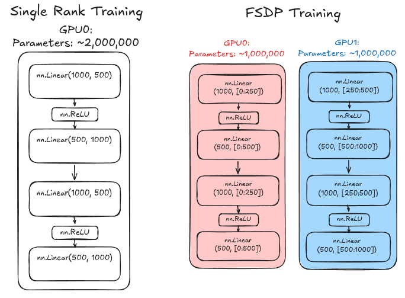
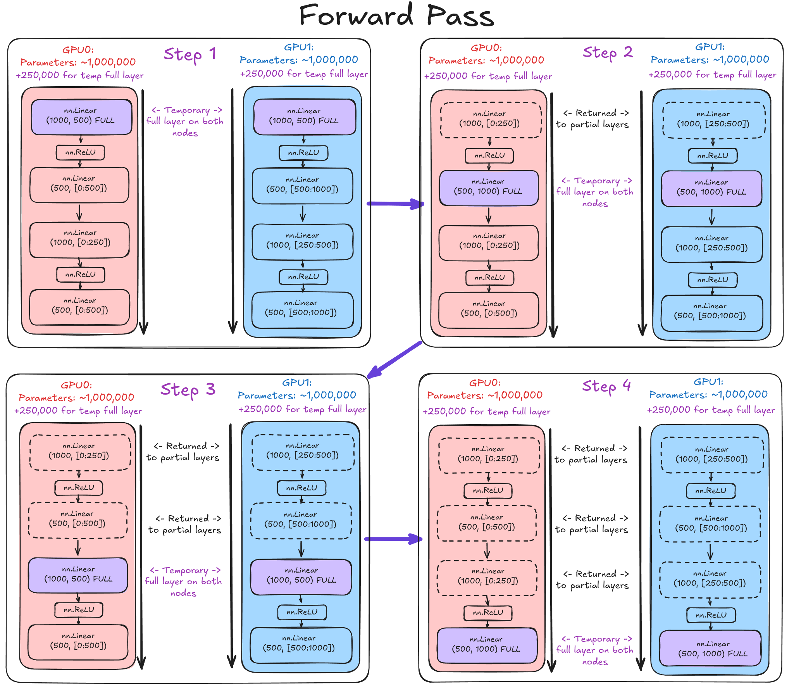
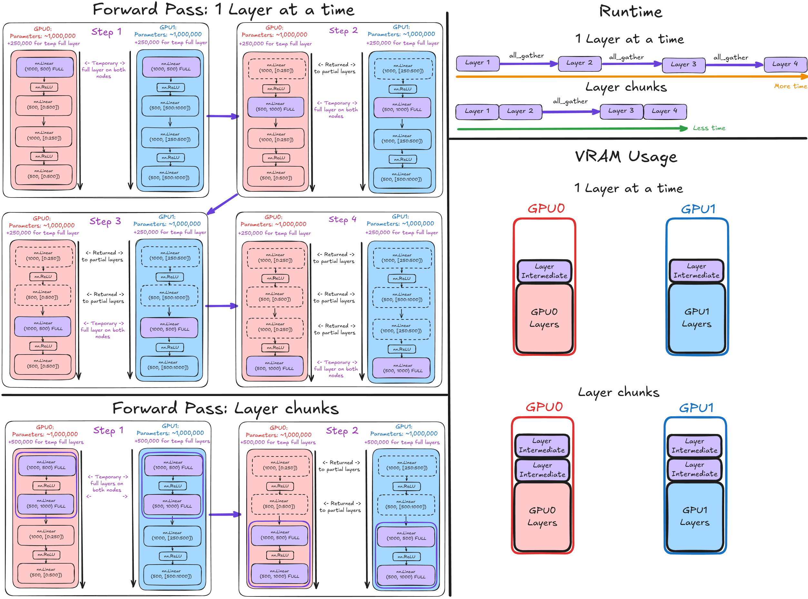

# Transformer Inference and Tensor Parallel

With `torch.DDP` and the other fundamentals under my belt. Its time to look into tensor parallel, and how transformer inference is done from a model shard perspective even closer to industry standard.


## Inspecting LLM Computation - `"HuggingFaceTB/SmolLM2-135M"`
Using the `torchview` package, I've exported a visual representation of the computational flow of the LLM I've been using. [The full plot is pretty large](./transformer_architecture.png).

Its often useful to visually inspect models, to give you a sense of relative scale of computation that can be missed form a quick glance at source code, though one must be sure to discount visual bloat from many cheap and redundant operations display that may make the computation look more expensive visually than it truly it.

Nonetheless, we can with our own eyes that by far the largest source of computation in this LLM is the Llama decoder layer. Just by visual inspection alone I can see about 30 of them.

Lets zoom in on the final such decoder layer, comprised from a `LlamaAttention` and `LlamaMLP`.


Here a batch size of 32, lets visualise where the main sections of attention are happening.


## Fully Shared Data Parallel (FSDP2)
First, lets get my head around fully sharded data parallel.
- [FSDP2 docs](https://docs.pytorch.org/tutorials/intermediate/FSDP_tutorial.html)

Before in plain old distributed data parallel, each rank had its own full copy of the model, but different batches of data, and the gradients of which could be `all_reduce`'d between nodes. This enables the following:

### **Vanilla `torch.DDP`:**
- Solves:
  - Allows a larger effective batch size during training
  - Allows a greater token-per-second throughput for a single model
    - Given the communication overhead don't dominate
- Does not solve:
  - Does not reduce footprint of `model activations`
    - Smallest GPU for `model activations` is still a bottleneck for model size in the entire mesh
  - Does not reduce footprint of `model parameters`
    - Smallest GPU for `model parameters` is still a bottleneck for model size in the entire mesh

**Fully sharded data parallel** takes things a step beyond vanilla DDP and allows the model `weights/parameters` to be shared across multiple ranks/GPUs.

At a high level, the initial idea is roughly to split the parameters of each layer between all ranks. E.g, for my 2 rank setup, each GPU will hold approximately half the `weights/parameters` of the network. As visualised below:


At each layer in the forward pass, the nodes communicate to temporarily each own the full layer object such that they can complete the forward pass .


If we have 4 layers as here, then thats 4 rounds of communication for the forward pass. Of course, if these 4 rounds of communication is too expensive time wise, we can materialise and propagate multiple layers at once, at the cost of additional VRAM


The way we control this is the level at which we call the `fully_shard()` function while iterating over the layers:
```py
from torch.distributed.fsdp import fully_shard, FSDPModule

model = HuggingfaceTransformer()

# Fewer layers at a time
for layer in model.model.layers:
    fully_shard(layer.self_attn)
    fully_shard(layer.mlp)
    fully_shard(layer)
fully_shard(model)

# More layers at a time
for layer in model.model.layers:
    fully_shard(layer)
fully_shard(model)
```

## Tensor Parallel
Places to read up on this would be:
- [Large scale transformer parallel](https://docs.pytorch.org/tutorials/intermediate/TP_tutorial.html)
- [Tensor Parallel API](https://docs.pytorch.org/docs/2.14/distributed.tensor.parallel.html)


## Unused Parameters and Graph Breaking
- I'm also going to explore unused parameters and graph breaking behaviour.