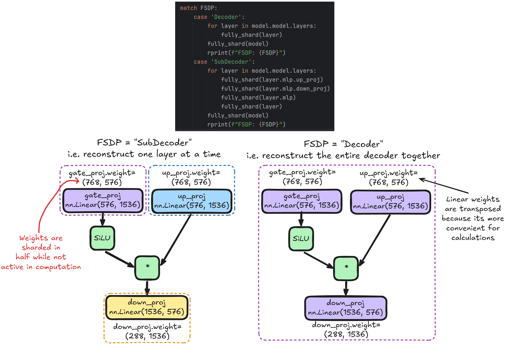
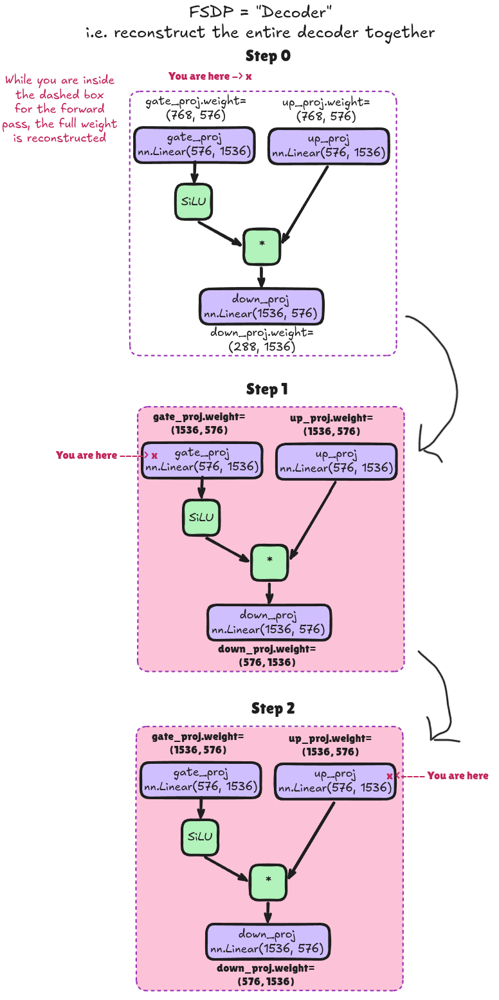
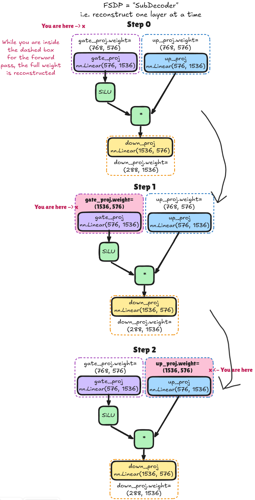

# Transformer Inference and Tensor Parallel

With `torch.DDP` and the other fundamentals under my belt. Its time to look into tensor parallel, and how transformer inference is done from a model shard perspective even closer to industry standard.


## Inspecting LLM Computation - `"HuggingFaceTB/SmolLM2-135M"`
Using the `torchview` package, I've exported a visual representation of the computational flow of the LLM I've been using. [The full plot is pretty large](./transformer_architecture.png).

Its often useful to visually inspect models, to give you a sense of relative scale of computation that can be missed form a quick glance at source code, though one must be sure to discount visual bloat from many cheap and redundant operations display that may make the computation look more expensive visually than it truly it.

Nonetheless, we can with our own eyes that by far the largest source of computation in this LLM is the Llama decoder layer. Just by visual inspection alone I can see about 30 of them.

Lets zoom in on the final such decoder layer, comprised from a `LlamaAttention` and `LlamaMLP`.


Here a batch size of 32, lets visualise where the main sections of attention are happening.


## Fully Shared Data Parallel (FSDP2)
First, lets get my head around fully sharded data parallel.
- [FSDP2 docs](https://docs.pytorch.org/tutorials/intermediate/FSDP_tutorial.html)

Before in plain old distributed data parallel, each rank had its own full copy of the model, but different batches of data, and the gradients of which could be `all_reduce`'d between nodes. This enables the following:

### **Vanilla `torch.DDP`:**
- Solves:
  - Allows a larger effective batch size during training
  - Allows a greater token-per-second throughput for a single model
    - Given the communication overhead don't dominate
- Does not solve:
  - Does not reduce footprint of `model activations`
    - Smallest GPU for `model activations` is still a bottleneck for model size in the entire mesh
  - Does not reduce footprint of `model parameters`
    - Smallest GPU for `model parameters` is still a bottleneck for model size in the entire mesh

**Fully sharded data parallel** takes things a step beyond vanilla DDP and allows the model `weights/parameters` to be shared across multiple ranks/GPUs.

At a high level, the initial idea is roughly to split the parameters of each layer between all ranks. E.g, for my 2 rank setup, each GPU will hold approximately half the `weights/parameters` of the network. As visualised below:


At each layer in the forward pass, the nodes communicate to temporarily each own the full layer object such that they can complete the forward pass .


If we have 4 layers as here, then thats 4 rounds of communication for the forward pass. Of course, if these 4 rounds of communication is too expensive time wise, we can materialise and propagate multiple layers at once, at the cost of additional VRAM


The way we control this is the level at which we call the `fully_shard()` function while iterating over the layers:
```py
from torch.distributed.fsdp import fully_shard, FSDPModule

model = HuggingfaceTransformer()

# Fewer layers at a time
for layer in model.model.layers:
    fully_shard(layer.self_attn)
    fully_shard(layer.mlp)
    fully_shard(layer)
fully_shard(model)

# More layers at a time
for layer in model.model.layers:
    fully_shard(layer)
fully_shard(model)
```

We can find the actual locally stored `DTensor` size with the `.to_local()` function:
```py
self.down_proj.weight = (576, 1536)             # Logical shape
self.down_proj.weight.to_local() = (288, 1536)  # Actual local shape
```






### Forward and Backwards:
For the forward pass, we only need an `all_gather()` to pull parameters in.

For the backwards pass, we need the same `all_gather()` per layer, but we may as well `all_scatter()` the calculated gradients we just calculated.

### Activations Burden
I assumed that I would easily buy myself enough VRAM for extra batches usin FSDP. However, the max batch size I could fit remained that same. Investigating further, it looks like thats because though the model parameters are indeed split between nodes, the activations and other memory burdens are still playing an outsized role.
```
with torch.autograd.graph.saved_tensors_hooks(
        pack_hook,
        unpack_hook,
):
    before = torch.cuda.memory_allocated()
    outputs = model(
        input_ids=input_ids,
        attention_mask=attention_mask,
        labels=input_ids,
    )
    torch.cuda.synchronize()

    peak = torch.cuda.max_memory_allocated()

    loss = outputs.loss

    print("Activations baseline:", before / 2 ** 30, "GB")
    print("Activations peak:    ", peak / 2 ** 30, "GB")
    print("Activations increase:", (peak - before) / 2 ** 30, "GB")

    optimizer.zero_grad()
    print(f"Memory allocated (before backward): {torch.cuda.memory_allocated(DEVICE)/1024**3:.2f} GB")
    print(f"Memory reserved (before backward): {torch.cuda.memory_reserved(DEVICE)/1024**3:.2f} GB")
    print("BACKWARDS BEGINS")
    loss.backward()

# Measure VRAM burdens
param_bytes_logical = sum(
    p.numel() * p.element_size()
    for p in model.parameters()
)
param_bytes_local = sum(
    p.to_local().numel() * p.element_size()
    for p in model.parameters()
)
grad_bytes = sum(
    p.grad.numel() * p.grad.element_size()
    for p in model.parameters()
    if p.grad is not None
)

print(f"saved activations: {saved_bytes / 1024 ** 2:.1f} MB")
print(f"parameters logical: {param_bytes_logical / 1024 ** 2:.1f} MB")
print(f"parameters local: {param_bytes_local / 1024 ** 2:.1f} MB")
print(f"gradients:  {grad_bytes / 1024 ** 2:.1f} MB")
print(f"Memory allocated (after backward): {torch.cuda.memory_allocated(DEVICE)/1024**3:.2f} GB")
      print(f"Memory reserved (after backward): {torch.cuda.memory_reserved(DEVICE)/1024**3:.2f} GB")
```

```
Activations baseline: 0.12635517120361328 GB
Activations peak:     6.569317817687988 GB
Activations increase: 6.442962646484375 GB
Memory allocated (before backward): 5.65 GB
Memory reserved (before backward): 7.13 GB
BACKWARDS BEGINS
saved activations: 9815.5 MB
parameters logical: 256.6 MB
parameters local: 128.3 MB
gradients:  256.6 MB
Memory allocated (after backward): 0.88 GB
Memory reserved (after backward): 8.19 GB
```
Tensor parallel is a way to deal with these increased activations


## Tensor Parallel
Places to read up on this would be:
- [Large scale transformer parallel](https://docs.pytorch.org/tutorials/intermediate/TP_tutorial.html)
- [Tensor Parallel API](https://docs.pytorch.org/docs/2.14/distributed.tensor.parallel.html)

### Tensor Parallel: Initial Thoughts
At this point in the learning process, it feels easy to lose track of exactly what problems each of the main parallel methods are solving if we're not thinking carefully. Why use DDP, FSDP, and Tensor parallel. The above docs mention that the uses of tensor parallel are:
- As world size becomes huge (128+ GPUs), FSDP collectives such as `allgather` start being dominated by ring latency. Applying TP **ON TOP OF** FSDP, that the FSDP world size could be reduced by e.g. a factor of 8 (though it seems to imply we'd need to take advantage of inter-host setup to gain some tensor parallel improvements that might not scale out if all GPUs were on their own nodes?).
- Hitting the data parallel limit where the global batch size cant be raised above the total number of GPUs just because the model is THAT big. Tensor/sequence paralle is the only way to 'ballpark' the global batch size and continue scaling.
- Some model designs smaller local batch sizes might allow tensor parallel to give more optimised matrix shapes for FLOPs in kernels.

I admit at this point, I only had a rough intuition of how these 3 concepts worked from the basics of the Tensor parallel definition, so lets put this all together in my head.


### `ParallelStyle` Configs
- `ColwiseParallel` | `RowwiseParallel`
- `SequenceParallel`
- `PrepareModuleInput` & `PrepareModuleOutput`


## Pipeline parallel


## Unused Parameters and Graph Breaking
- I'm also going to explore unused parameters and graph breaking behaviour.