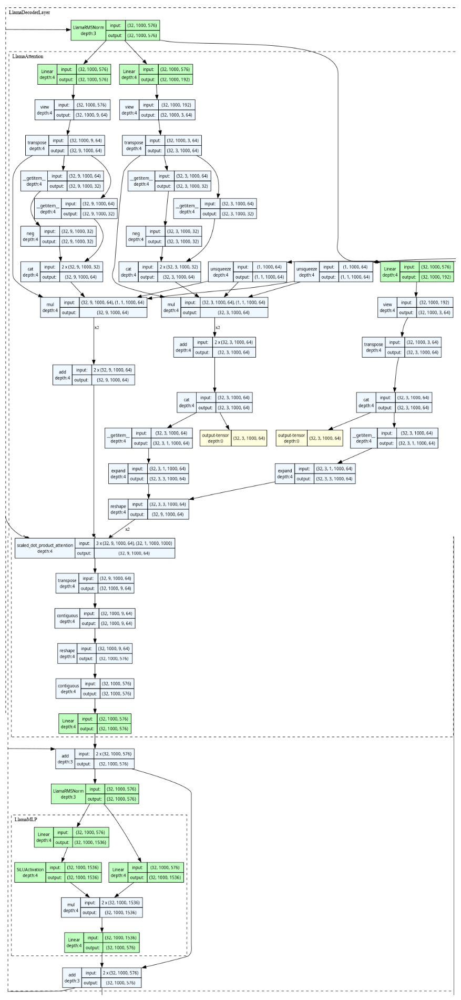
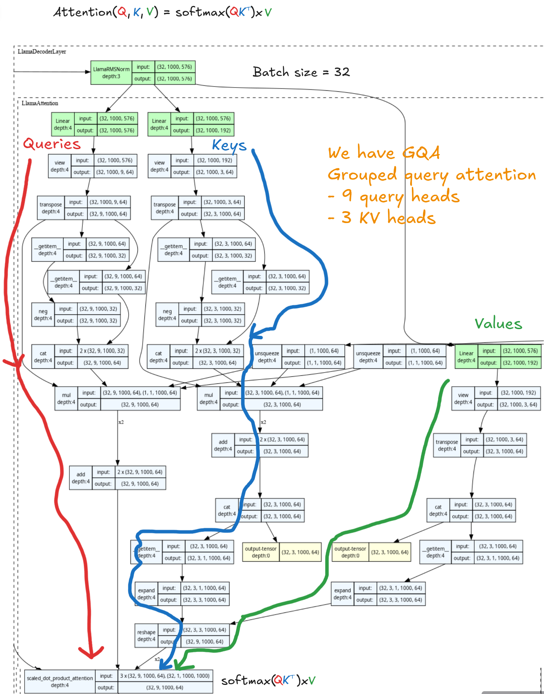

# Transformer Inference and Tensor Parallel

With `torch.DDP` and the other fundamentals under my belt. Its time to look into tensor parallel, and how transformer inference is done from a model shard perspective even closer to industry standard.

## Inspecting LLM Computation - `"HuggingFaceTB/SmolLM2-135M"`
Using the `torchview` package, I've exported a visual representation of the computational flow of the LLM I've been using. [The full plot is pretty large](./transformer_architecture.png).

Its often useful to visually inspect models, to give you a sense of relative scale of computation that can be missed form a quick glance at source code, though one must be sure to discount visual bloat from many cheap and redundant operations display that may make the computation look more expensive visually than it truly it.

Nonetheless, we can with our own eyes that by far the largest source of computation in this LLM is the Llama decoder layer. Just by visual inspection alone I can see about 30 of them.

Lets zoom in on the final such decoder layer, comprised from a `LlamaAttention` and `LlamaMLP`.

Here a batch size of 32, lets visualise where the main sections of attention are happening.

## Fully Shared Data Parallel (FSDP2)
First, lets get my head around fully sharded data parallel.
- [FSDP2 docs](https://docs.pytorch.org/tutorials/intermediate/FSDP_tutorial.html)

## Tensor Parallel
Places to read up on this would be:
- [Large scale transformer parallel](https://docs.pytorch.org/tutorials/intermediate/TP_tutorial.html)
- [Tensor Parallel API](https://docs.pytorch.org/docs/2.14/distributed.tensor.parallel.html)

## Unused Parameters and Graph Breaking
- I'm also going to explore unused parameters and graph breaking behaviour.